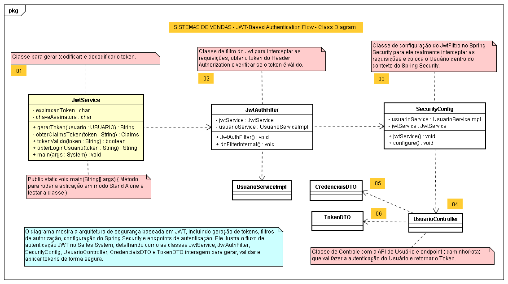
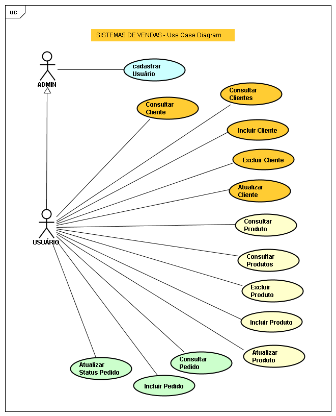
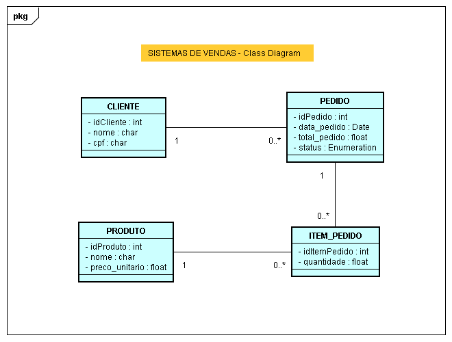

# 📦 SISTEMA DE VENDAS — Backend

Este é o **Backend** do **Sistema de Vendas**, desenvolvido em **Java**, com **Spring Boot** e arquitetura em camadas.  
Gerencia **clientes**, **produtos**, **pedidos** e **itens de pedido**, incluindo toda a lógica de negócios, segurança JWT e persistência de dados.

---

## 🚀 Tecnologias Utilizadas

- Java 17+
- Spring Boot
- Spring Data JPA
- H2 Database (desenvolvimento)
- Maven
- STS-4 ou VSCode

---

## 📂 Estrutura do Projeto

- **src/main/java** — Código-fonte principal
- **src/main/resources** — Configurações e propriedades
- **src/test/java** — Testes unitários
- **target/** — Artefatos gerados pelo Maven
- **/docs/** — Diagramas UML e documentação extra

---

## ⚙️ Como Executar Localmente

### 1️⃣ **Clone o repositório**

git clone https://github.com/abnobrega/vendas-repositorio.git

--- 

### 2️⃣ **Acesse o diretório**

cd vendas-new

---

### 3️⃣ **Execute o projeto**

No STS-4, rode a aplicação como Spring Boot App ou via terminal

./mvnw spring-boot:run

- Por padrão, o sistema estará disponível em http://localhost:8080.

---

### 4️⃣ **Acesse o console H2**

- URL: http://localhost:8080/h2-console

- JDBC URL: jdbc:h2:mem:testdb

--- 

### 🔐 Autenticação JWT
O sistema utiliza JWT (JSON Web Token) para autenticação.

🚀Fluxo principal:
- Usuário envia credenciais.

- Backend gera e devolve o token.

- Requisições subsequentes usam o token no Authorization Header.

---

### ✅ Funcionalidades principais
- 📁 Cadastro, consulta, atualização e exclusão de clientes

- 📦 Gerenciamento de produtos

- 🗂️ Criação e consulta de pedidos

- 🔐 Segurança com Spring Security + JWT

---

### 📊 Diagramas UML

## 🗂️ SISTEMA-DE-VENDAS-JWT-Based-Authentication-Flow-Class-Diagram

## 🗂️ SISTEMA-DE-VENDAS-Use-Case-Diagram

## 🗂️ SISTEMA-DE-VENDAS-Class-Diagram

---

### 👨‍💻 Author
- Developed by Alexandre Bonturi Nóbrega
- Independent Backend & Web3 Software Engineer
- LinkedIn: https://www.linkedin.com/in/alexandrebonturinobrega/

---

### 📄 Licença
- Este projeto é de uso pessoal e educacional.

